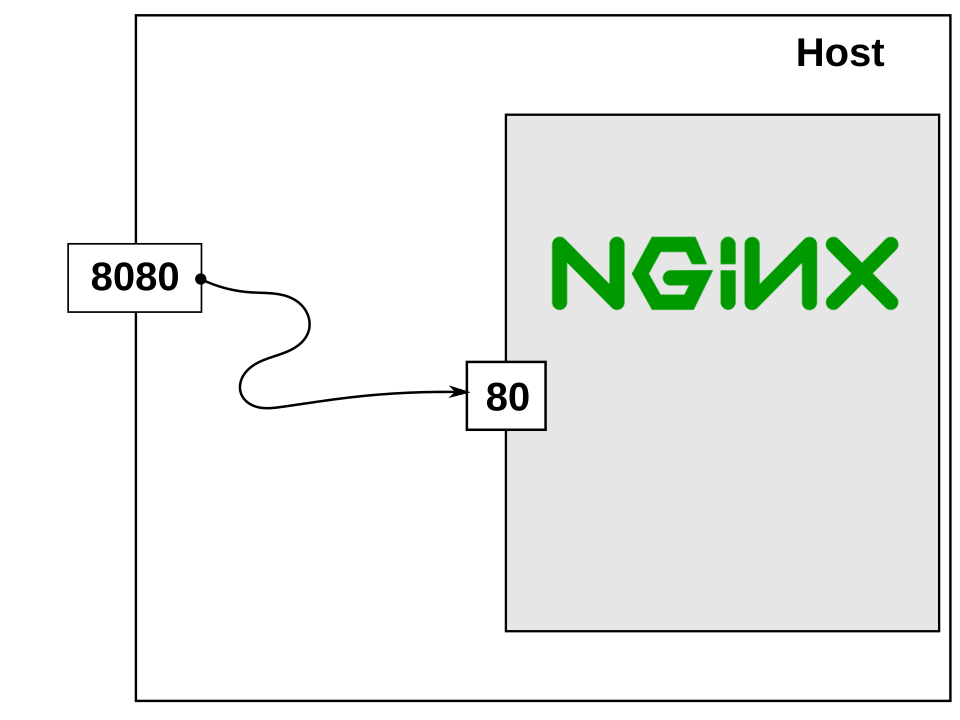
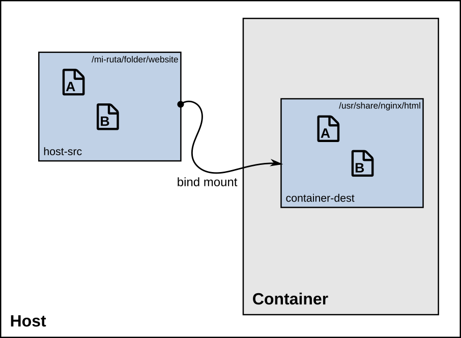
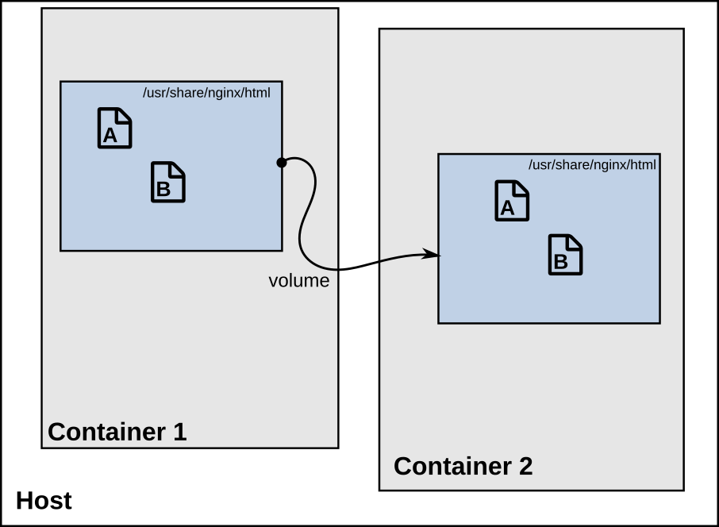

<!-- _class: lead gaia -->


# Docker

¿Qué es y cómo usarlo?

---

# ¿Qué es Docker?

- Docker es una aplicación para correr contenedores.
- Sirve para correr aplicaciones de manera aislada.
- Parecida a una máquina virtual.
- Es muy útil para hacer despliegue de aplicaciones.

--- 


---

# Imagen de Docker

Es una fotografía del sistema que quieres ejecutar para correr tu aplicación:

  - SO,
  - dependencias,
  - código de la aplicación.

---

# Contenedor

Un contenedor es un proceso que ejecuta una imagen. 

---



# Mapeo de puertos

Asociamos el puerto **8080** de la máquina host al puerto **80** que expone el contenedor de NGNIX

```
docker run -p 8080:80 nginx:latest
```
---



### Compartir archivos entre _host_ y _container_

```
docker run -d --name website -p 8080:80 \
  -v /mi-ruta/folder/website:/usr/share/nginx/html:ro \
  nginx:latest
```
---



### Compartir archivos entre _containers_

```
docker run -d --name website2 -p 8081:80 \
  --volumes-from website  \
  nginx:latest
```
---
# Dockerfile

- Es una manera de crear una imagen de Docker

```
FROM alpine:3
CMD ["sh", "-c", "echo 'Hola desde mi contenedor '$HOSTNAME"]
```
---
# _Tags_, versionamiento y etiquetado

- Permite tener un control sobre la versión de la imagen
- Evita que haya cambios que modifiquen la aplicación